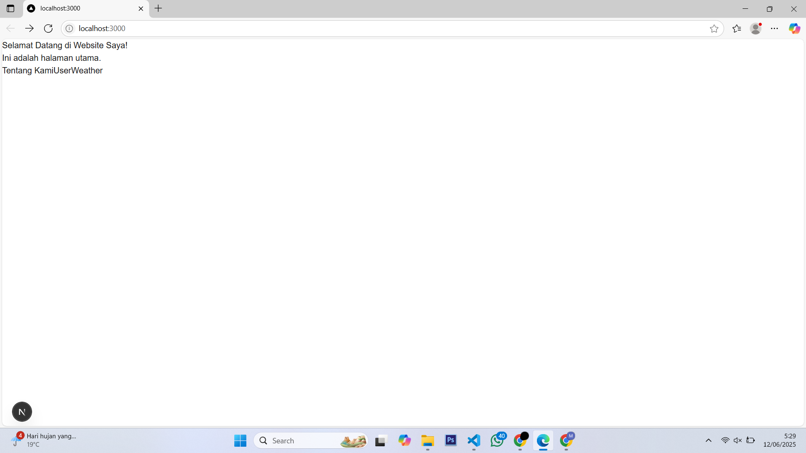
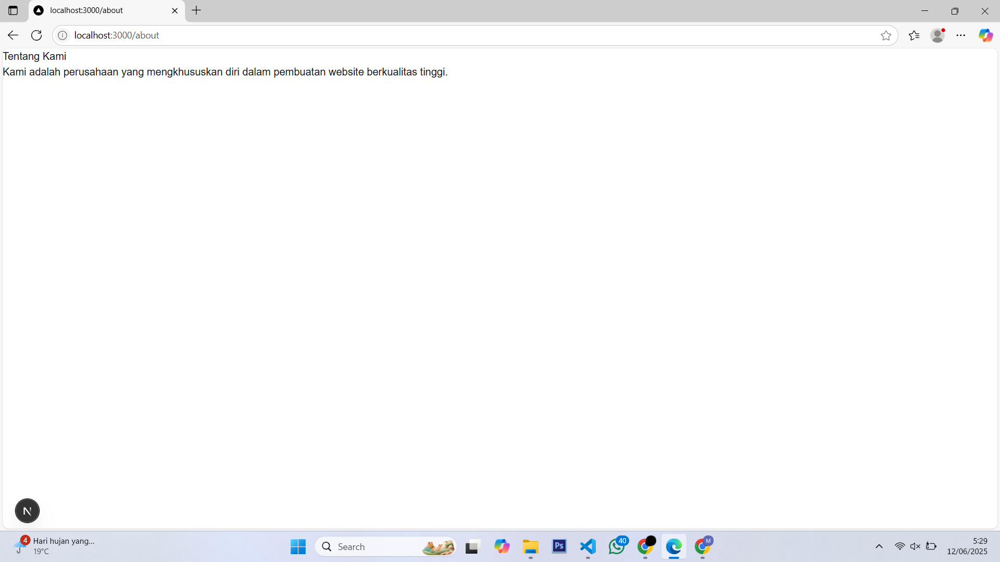
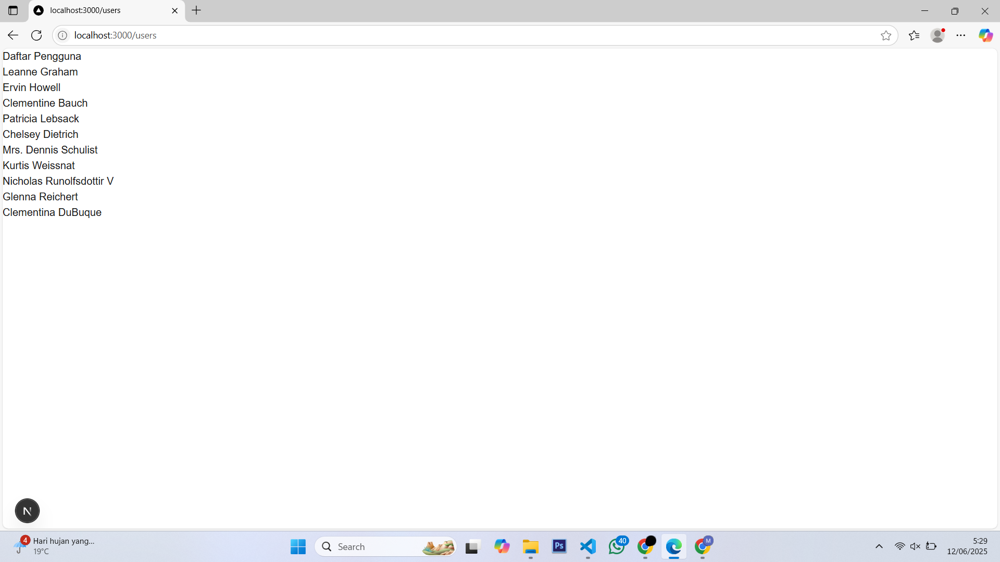
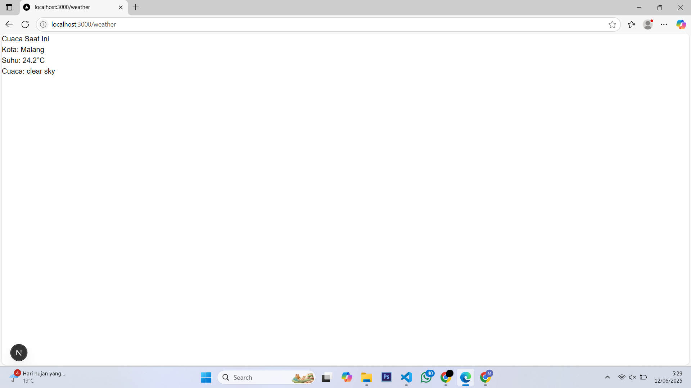

## Laporan Praktikum

|  | Pemrograman Berbasis Framework 2025 |
|--|--|
| NIM |  244107027015|
| Nama |  Muhamad Saifulloh Bahroin Gana Perkasa |
| Kelas | TI - 4K |

### Tugas

1. Buat halaman baru dengan menggunakan Static Site Generation (SSG) yang menampilkan daftar
pengguna dari API https://jsonplaceholder.typicode.com/users.

2. Implementasikan Dynamic Routes untuk menampilkan detail pengguna berdasarkan ID.

3. Buat API route yang mengembalikan data cuaca dari API eksternal (misalnya, OpenWeatherMap)
dan tampilkan data tersebut di halaman front-end.

## Jawaban

--- Halaman Depan

--- Halaman about

--- Halaman users

--- Halaman weather

